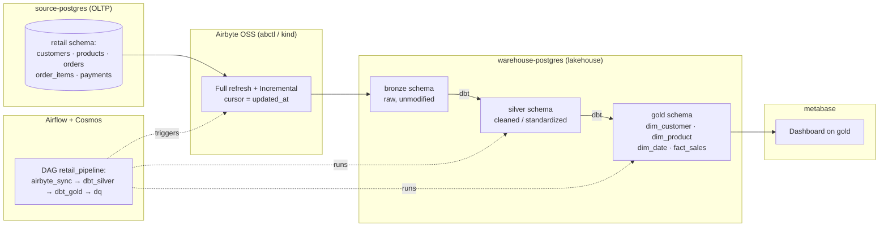

# Retail Analytics Data Platform — Architecture & Design (Dockerized POC)

End-to-end retail analytics lakehouse built on a **local, free, fully-containerized** stack.
The entire platform comes up with `docker compose up` (plus Airbyte, which ships its own
installer). This document is the single source of truth; `design/DEPLOYMENT.md` details the
Docker topology, and the four skills under `.claude/skills/` operationalize each phase.

---

## 1. Design goals

- **Docker-first.** Every long-running component is a container in one compose project.
  One command starts the platform; volumes make it reproducible and resettable.
- **Zero cloud cost.** Runs entirely on one machine with free/OSS software.
- **Faithful to the spec.** Same concepts as the managed version (Medallion, Airbyte
  ingestion, dbt, Airflow+Cosmos, CI/CD, data quality, BI) — only the *implementations*
  are swapped for containerizable equivalents.
- **POC-sized.** Small data volumes, LocalExecutor, single-node — optimized for clarity
  and a laptop, not scale.

## 2. Spec → local (Docker) substitution map

| Spec component          | Managed tool (spec)  | Dockerized substitute (this POC)                               | Why                                                        |
|-------------------------|----------------------|----------------------------------------------------------------|------------------------------------------------------------|
| Source DB               | PostgreSQL           | **`source-postgres`** container (auto-seeded from DDL)          | Unchanged concept                                          |
| Ingestion               | Airbyte → Databricks | **Airbyte OSS** (`abctl`) → warehouse **bronze** schema         | Airbyte is spec-required; Postgres destination is rock-solid|
| Lakehouse / Medallion   | Databricks + Delta   | **`warehouse-postgres`** with `bronze`/`silver`/`gold` schemas  | DuckDB is single-writer/file-locked — unsafe across containers; Postgres is multi-connection |
| Transformations         | dbt (Databricks)     | **dbt-postgres** (run inside Airflow via Cosmos)               | First-class, containerizable                               |
| Orchestration           | Airflow + Cosmos     | **Airflow + astronomer-cosmos** (containers, LocalExecutor)     | Unchanged concept                                          |
| Version control / CI/CD | GitLab CI            | **Git + GitLab** `.gitlab-ci.yml`                              | Unchanged concept                                          |
| Data quality            | ad-hoc               | **dbt tests + dbt-expectations + reconciliation task**         | Runs in-pipeline                                           |
| Reporting               | Power BI Service     | **`metabase`** container on `gold` (Power BI = optional external)| Power BI Desktop can't be containerized                    |

> **Authentic-lakehouse variant (optional):** add a **MinIO** container as an S3 data lake,
> point Airbyte's S3/Parquet destination at it for Bronze files, and use **dbt-duckdb** with
> `httpfs` to read Parquet. Closer to Databricks/Delta, but adds the DuckDB single-writer
> constraint and more moving parts — kept optional. The **default** design is the Postgres
> warehouse above.

## 3. High-level data flow



Airflow controls **when** things run; Airbyte moves **raw** data to `bronze`; dbt shapes
`bronze → silver → gold`; Metabase reads `gold` only.

## 4. Source data model (Phase 1)

Schema `retail` in `source-postgres`. Every table carries `updated_at` for incremental sync.

- **customers**(`customer_id` PK, first_name, last_name, email, phone, city, country, signup_date, `updated_at`)
- **products**(`product_id` PK, product_name, category, brand, price, in_stock, `updated_at`)
- **orders**(`order_id` PK, `customer_id` FK, order_date, status, total_amount, `updated_at`)
- **order_items**(`order_item_id` PK, `order_id` FK, `product_id` FK, quantity, unit_price)
- **payments**(`payment_id` PK, `order_id` FK, payment_method, amount, payment_status, payment_date, `updated_at`)

`order_items` bridges orders↔products so `fact_sales` carries a product dimension
(line-item grain). The spec's four entities (customer/product/order/payment) are all present.
DDL + dummy seed: [`source/ddl/01_create_and_seed.sql`](../source/ddl/01_create_and_seed.sql)
— mounted into the container's `/docker-entrypoint-initdb.d/` so the DB self-seeds on first
boot. Phase-1 also loads **products from a public API** (Fake Store API) via a Python loader.

## 5. Medallion layer contracts (Phases 3-4)

Layers are **schemas in `warehouse-postgres`**:

| Layer  | Storage / materialization              | Rules                                                                 |
|--------|----------------------------------------|-----------------------------------------------------------------------|
| Bronze | `bronze.*` tables (Airbyte destination)| Raw, **no modifications**. 1:1 with source + Airbyte metadata columns. |
| Silver | `silver.*` dbt views/tables            | Dedupe on PK+`updated_at`, handle nulls, cast types, standardize names/codes. One `stg_` model per source table. |
| Gold   | `gold.*` dbt tables                    | Business-ready **star schema** for BI.                                 |

**Gold star schema:**

- **dim_customer**(customer_key SK, customer_id, full_name, email, city, country, signup_date)
- **dim_product**(product_key SK, product_id, product_name, category, brand, price)
- **dim_date**(date_key, date, day, month, quarter, year) — generated
- **fact_sales**(sales_key, order_id, order_item_id, customer_key FK, product_key FK,
  date_key FK, quantity, unit_price, line_amount, payment_method, payment_status)
  — grain: **one order line item**.

## 6. Orchestration (Phase 5)

Airflow DAG `retail_pipeline` (dbt runs via astronomer-cosmos):

```
airbyte_sync  →  dbt_silver (Cosmos TaskGroup)  →  dbt_gold (Cosmos TaskGroup)  →  dq_reconciliation
```

- `airbyte_sync`: `AirbyteTriggerSyncOperator` triggers the connection and waits.
- dbt layers rendered as Cosmos `DbtTaskGroup`s selecting by tag (`silver`, `gold`).
- Failure stops downstream; retries + alerting configured.

## 7. Version control & CI/CD (Phase 6)

- Git repo, **trunk + short-lived feature branches**, changes land via **merge requests**.
- `.gitlab-ci.yml` stages: `lint` (sqlfluff) → `compile` (`dbt parse`) → `test`
  (`dbt build` against an ephemeral CI Postgres seeded with fixtures). MR is green-gated.

## 8. Data quality & monitoring (Phase 7)

- **In-pipeline tests (dbt):** `unique`, `not_null`, `relationships`, `accepted_values`;
  `dbt-expectations` for row-count ranges and value distributions.
- **Reconciliation:** a task comparing `source-postgres` row counts & key aggregate sums vs
  `gold` — the "source vs target reconciliation" requirement.
- **Four required checks** (row count, duplicate, null, source-vs-target) map to specific
  dbt tests + the reconciliation task (see skill 03).
- **Monitoring:** where to find Airflow, Airbyte, and dbt logs + how to read them (runbook).

## 9. Reporting (Phase 8)

**Metabase** (container) connects natively to `warehouse-postgres`, reads the `gold` schema,
and serves the dashboard: Total Sales, Total Orders, Total Customers (KPI cards), Sales Trend
(line over `dim_date`), Product Performance (bar by category/product). Follow the `dataviz`
skill for color/layout. **Power BI Desktop** can optionally connect to the same warehouse
Postgres (host port) for those who want the exact spec tool — it just runs outside Docker.

## 10. Documentation (Phase 9) & final presentation (Phase 10)

Deliverables: this architecture doc + diagrams, `DEPLOYMENT.md`, a **Setup Guide**, a **Data
Dictionary** (from dbt docs + source dict), and a **Runbook** (operate, monitor, recover).
Presentation covers architecture, data flow, each tool, DQ strategy, dashboard walkthrough,
and key learnings.

## 11. Repository layout (target)

```
.
├── design/
│   ├── ARCHITECTURE.md               # this file
│   └── DEPLOYMENT.md                 # Docker topology, services, ports, volumes, startup
├── .claude/skills/                   # the 4 lifecycle skills
├── deploy/
│   ├── docker-compose.yml            # source-postgres, warehouse-postgres, airflow*, metabase
│   ├── .env.example                  # ports, credentials, image tags
│   └── airflow/Dockerfile            # airflow + cosmos + dbt-postgres image
├── source/                           # Phase 1: DDL + seed, csv, python loaders
├── airbyte/                          # Phase 2: connection config / notes (abctl)
├── dbt/retail/                       # Phases 3-4: dbt-postgres project (staging/silver/gold)
├── airflow/dags/                     # Phase 5: retail_pipeline DAG + cosmos config
├── .gitlab-ci.yml                    # Phase 6
├── quality/                          # Phase 7: reconciliation script, DQ notes
├── reporting/                        # Phase 8: metabase notes / dashboard export
└── docs/                             # Phase 9: setup guide, data dictionary, runbook
```

## 12. Deployment

See **[`design/DEPLOYMENT.md`](DEPLOYMENT.md)** for the full container inventory, port map,
volumes, networks, startup order, Airbyte integration, resource footprint, and lean-vs-full
run modes.

## 13. Phase → skill index

| Phases                          | Skill                                    |
|---------------------------------|------------------------------------------|
| 1 Source, 2 Ingestion           | `ecommerce-setup-ingest`                 |
| 3 Medallion, 4 dbt              | `ecommerce-build-transform`              |
| 5 Airflow, 6 CI/CD, 7 DQ/Monitor| `ecommerce-orchestrate-operate`          |
| 8 Reporting, 9 Docs, 10 Present | `ecommerce-report-document`              |
