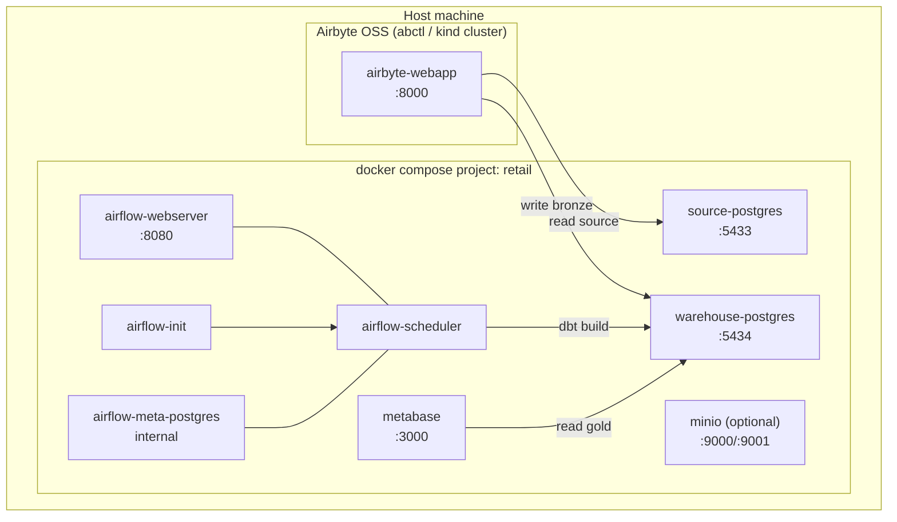

# Docker Deployment Design (POC)

How the whole Retail Analytics platform runs in containers. Companion to
`design/ARCHITECTURE.md`. Default design = **Postgres warehouse** (see ARCHITECTURE §2).

---

## 1. Container topology



All compose services share one bridge network `retail-net` and talk by service name
(`warehouse-postgres:5432`). Airbyte runs in its own `abctl` Kubernetes (kind) cluster and
reaches the compose Postgres containers via the **host's published ports** (see §5).

## 2. Service inventory

| Service | Image | Purpose | Host port | Key volumes | Depends on |
|---|---|---|---|---|---|
| `source-postgres` | `postgres:16` | Retail OLTP source; self-seeds from DDL | `5433:5432` | `pgdata-source`; `../source/ddl → /docker-entrypoint-initdb.d:ro` | — |
| `warehouse-postgres` | `postgres:16` | Lakehouse: `bronze`/`silver`/`gold` schemas | `5434:5432` | `pgdata-warehouse` | — |
| `airflow-meta-postgres` | `postgres:16` | Airflow metadata DB | internal | `pgdata-airflow` | — |
| `airflow-init` | custom (`deploy/airflow/Dockerfile`) | `db migrate` + create admin user, then exits | — | shared dags/dbt mounts | `airflow-meta-postgres` (healthy) |
| `airflow-scheduler` | custom | Runs DAGs + dbt via Cosmos | — | `../airflow/dags`, `../dbt`, `../quality` | `airflow-init` (completed) |
| `airflow-webserver` | custom | Airflow UI | `8080:8080` | `../airflow/dags` | `airflow-init` (completed) |
| `metabase` | `metabase/metabase:latest` | BI dashboard on `gold` | `3000:3000` | `mb-data` (H2 app db) | `warehouse-postgres` (healthy) |
| `minio` *(optional)* | `minio/minio` | S3 data lake for Parquet Bronze variant | `9000:9000`,`9001:9001` | `minio-data` | — |

Custom Airflow image = official Airflow + `astronomer-cosmos`, `dbt-postgres`,
`apache-airflow-providers-airbyte`, `dbt-expectations` deps.

## 3. Ports (host)

| Port | Service | Notes |
|---|---|---|
| 5433 | source-postgres | mapped off 5432 to avoid clashing with any native Postgres |
| 5434 | warehouse-postgres | |
| 8080 | airflow-webserver | admin / admin (POC only) |
| 3000 | metabase | first-run setup wizard |
| 8000 | airbyte-webapp | from `abctl` |
| 9000/9001 | minio (optional) | S3 API / console |

> The current dummy data was seeded into a **native** Postgres on host `:5432`. In the
> Dockerized design that data is reproduced by mounting the same seed SQL into
> `source-postgres`, which auto-runs it on first boot — no manual migration needed.

## 4. Volumes, networks, config

- **Named volumes** persist each database and Metabase app state across restarts.
- **Bind mounts** put project code (`dags/`, `dbt/`, `source/ddl/`) into the containers so
  edits are live without rebuilds.
- **Network:** single user-defined bridge `retail-net`.
- **Config/secrets:** `deploy/.env` (gitignored) supplies ports, DB users/passwords, and
  image tags; `deploy/.env.example` is committed. No secrets in compose or code.
- **Healthchecks:** each Postgres uses `pg_isready`; dependents wait via
  `depends_on: condition: service_healthy`.

## 5. Airbyte integration (separate stack)

Modern Airbyte OSS installs via `abctl local install` (spins a local kind cluster) — it is
**not** a compose service. Wiring on Linux:

- **Source (Postgres):** host `host.docker.internal` (or the host LAN IP), port **5433**,
  db `retail`/`testdb`, schema `retail`.
- **Destination (Postgres):** same host, port **5434**, target schema `bronze` in
  `warehouse-postgres`.
- Enable `host.docker.internal` for the kind cluster, or use the host's IP; document the
  exact values in `airbyte/README.md`.
- Sync modes: Full Refresh|Overwrite first, then Incremental|Append+Dedup with cursor
  `updated_at` and each stream's PK.

## 6. Startup order & commands

```bash
# 1. platform
cp deploy/.env.example deploy/.env          # then edit credentials
docker compose -f deploy/docker-compose.yml up -d
#   order enforced by healthchecks:
#   *-postgres → airflow-init → airflow-scheduler/webserver ; metabase after warehouse

# 2. ingestion (once, separately)
abctl local install                          # Airbyte UI at :8000
#   configure source/destination/connection per §5, run syncs

# 3. transformations run via Airflow DAG (or ad hoc):
docker compose -f deploy/docker-compose.yml run --rm airflow-scheduler \
  dbt build --project-dir /opt/dbt/retail
```

Teardown: `docker compose -f deploy/docker-compose.yml down` (add `-v` to wipe data and
re-seed from scratch).

## 7. Resource footprint & run modes

Full stack is heavy for a laptop: 3 Postgres + 3 Airflow + Metabase, **plus** Airbyte's kind
cluster (~10 pods). Budget **~8 GB RAM**.

- **Lean mode (recommended for a POC laptop):** run Airbyte only while doing an initial
  Bronze load, then stop it (`abctl local uninstall` or pause) — the warehouse keeps the
  data and dbt/Airflow/Metabase run without it. Re-start Airbyte only to refresh Bronze.
- **Full mode:** everything up simultaneously (for the end-to-end orchestration demo).
- **Compose profiles:** `minio` is behind a `--profile lake` flag so the default `up`
  stays lean; enable it only for the Parquet-lakehouse variant.

## 8. Reset / reproducibility

`docker compose down -v && docker compose up -d` rebuilds the entire platform from scratch:
`source-postgres` re-seeds from `source/ddl/`, warehouse schemas are recreated by the first
dbt run, and Airbyte re-syncs Bronze. Nothing depends on manual host state.
